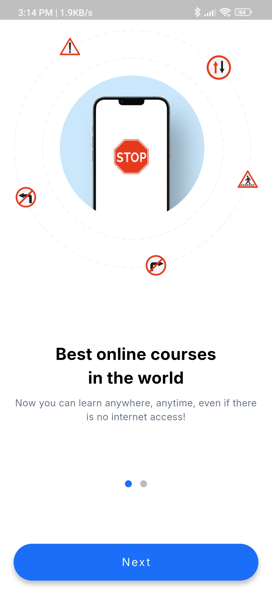
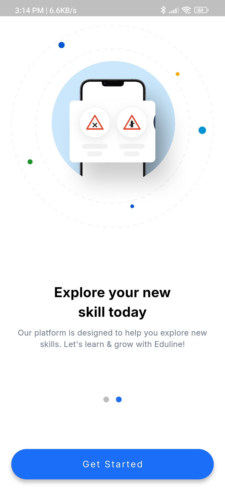
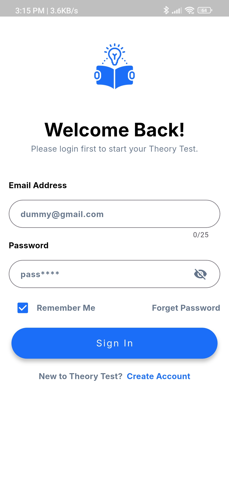
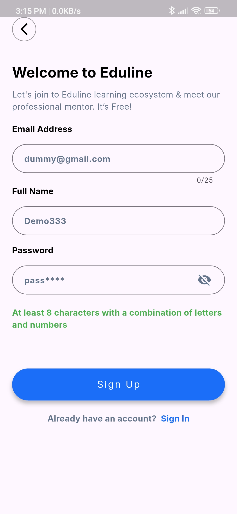
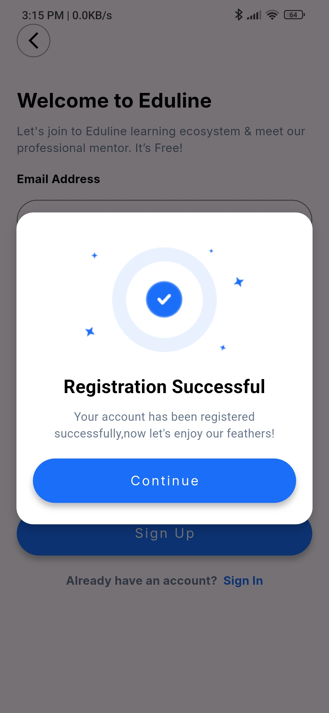
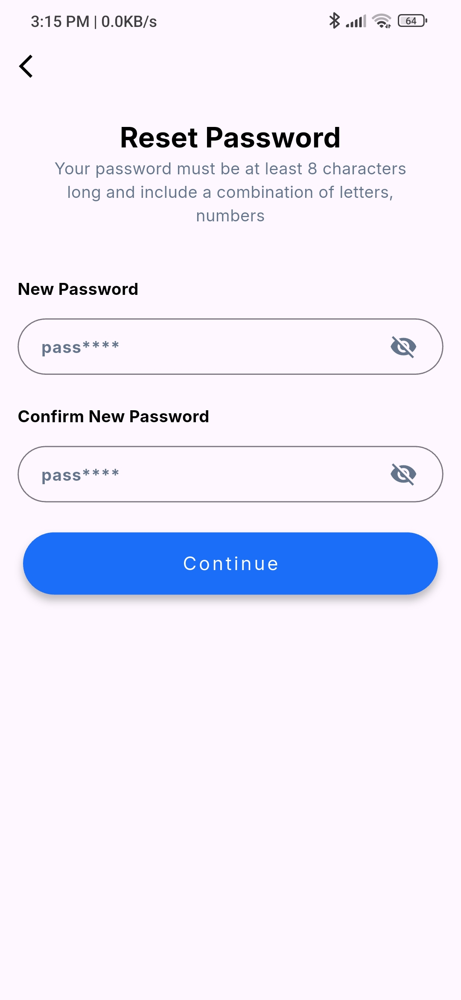
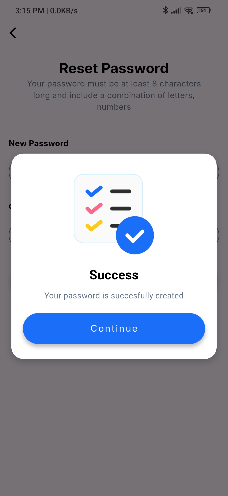
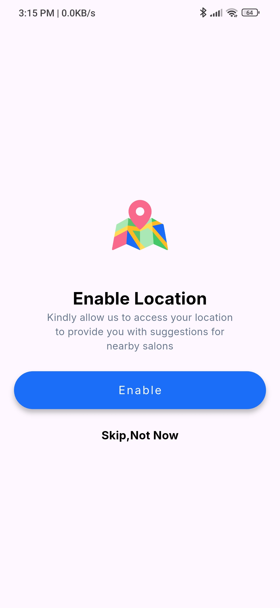

# 🛍️ E-course-area

Production-ready Flutter app featuring a modern, responsive UI and a complete authentication system powered by RESTful APIs and GetX state management. Implements secure token-based authentication (login & registration) using the http package with robust error handling and reactive state control.

---

## 🖼️ App Preview

| Splash | Onbording | Onbording |
|----------|------|------|
|  |  |  |

| Sign In | Sign Up | Sign Up Success |
|----------|-----------|------|
|  |  |  |

| Forgot Password | Reset Password | Reset Success |
|----------|------|------|
|  |  |  |

| Location | Select Country
|----------|------|
|  |  |

---

## 📱 Features

- 🎨 Clean and responsive UI  
- ⚡ Fast performance  
- 🧭 Smooth navigation using GetX  
- 🛠️ Well-structured project architecture  
- 🌐 API-ready setup and authenticator using RestApi
- 💾 Local storage support using GetStorage  

---

## 🧩 Tech Stack

| Category | Technology |
|-----------|-------------|
| Framework | Flutter |
| Language | Dart |
| State Management | GetX |
| Storage | GetStorage |
| authenticator | http RestApi
| UI Toolkit | Material Design |

---

## 🚀 Getting Started

Follow these steps to set up and run the project locally 👇

### 1️⃣ Clone the repository
```bash
git clone https://github.com/rakibul-islam2k23/E-zone.git
